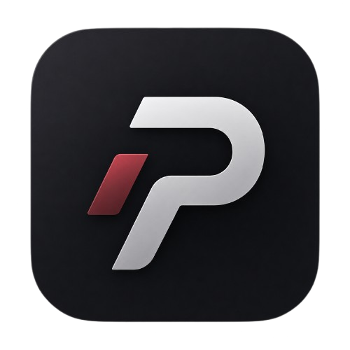

<p align="center">
  
</p>

<h1 align="center">PERFECT APP</h1>

<p align="center">
  <strong>Your personal life dashboard, built for clarity.</strong><br />
  Health, money, routines, plans, and the details that keep life moving.
</p>

<p align="center">
  
  
  
</p>

## Overview

Perfect App is a premium, offline-first Android app for managing the practical parts of
everyday life in one focused place. It brings personal health, nutrition, hydration,
finances, schedules, vehicle care, subscriptions, and reminders into a single dashboard.

Everything is designed for personal use: fast local storage, no account, no login, no cloud,
and no dependency on an internet connection.

## Highlights

### Refreshed navigation and widgets

- System-aware light and dark themes with ruby red accents and neutral silver surfaces, animated tab selection, screen fades, and smooth card/progress updates
- Labeled, horizontally scrollable bottom tabs for every section, including Car, Renewals, Widgets, Search, Alerts, Backup, and Settings
- A Widgets tab with a Today widget pinning button (or manual instructions for launchers without pinning support)
- A resizable Today widget with net worth and money at the top, tasks/reminders on the left and birthday countdowns on the right beneath it, followed by daily progress and quick actions
- Widgets load saved data before rendering, observe live changes, refresh after database changes, and request periodic launcher updates every 30 minutes (Android may defer these)
- Calendar widgets include recurring events and omit completed items; old repeating series no longer disappear after 500 elapsed occurrences

To add the dashboard widget, swipe the bottom tabs to **Widgets**, choose **Add Today widget**, and confirm the launcher prompt. Enabled summaries appear at every size; scroll inside the widget for overflow or expand it to see more. Configure summaries, financial privacy, and three shortcuts in Widgets. Tap individual items to open the relevant screen.

Validation: debug build and 14 unit tests pass, including calendar recurrence and birthday regression tests. Emulator checks covered navigation, dashboard widget pinning/rendering, opening the app from the widget, and automatic refresh after saving a recurring calendar event.

### Today widget and birthdays

- Net worth and the money summary appear first. Tasks/reminders on the left and birthday countdowns on the right sit beneath them.
- Enabled money and net-worth summaries appear at every widget size, with scrolling for overflow. Net worth can be enabled independently of the money summary.
- Widget settings update live. Enable Show financial amounts to reveal values.
- Calendar has a Birthdays view and an add-birthday flow that saves all-day yearly events.
- Birthday countdown regression tests cover today, tomorrow, year rollover, and February 29.

### One calm dashboard

- Live summaries for health, diet, water, wealth, calendar events, car maintenance, and reminders
- Quick actions for the things you record most often
- Reusable premium cards, progress indicators, countdowns, and metric rows
- Search across the app when you need to find something quickly

### Health and habits

- Body measurements with weight, BMI, body fat, fat mass, and progress trends
- Segmental body composition tracking
- Activity logging and measurement history
- Daily calorie, macro, and hydration goals
- Meal entries with calories, protein, carbohydrates, and fat
- Water logging with daily progress

### Money, plans, and responsibilities

- Assets, transactions, net worth snapshots, and multi-currency values
- Local exchange-rate management
- Subscriptions with recurring due dates and bookkeeping automation
- Calendar events with repeating occurrences and reminders
- Vehicle profile, odometer history, fuel, and maintenance records
- Renewals and important due-date reminders

### Android-native utility

- One responsive Today home-screen widget for events, reminders, daily progress, and money
- AlarmManager wake-ups with WorkManager-powered notification delivery and daily summaries
- Notifications rescheduled after device reboot
- Local backup and restore support
- Adaptive launcher icon and a dark premium Material 3 theme

## Privacy by design

Perfect App is deliberately offline-first.

- No account system or login
- No backend, cloud sync, analytics, or third-party API requirement
- Data is stored locally on the Android device using Room
- Local configuration, signing keys, environment files, database files, backups, exports, build output, and local screenshots under `.tmp/` are excluded from Git
- Subscription auto-charging is only local bookkeeping; it never contacts a bank,
  card network, payment processor, or external service

## Technology

- **Platform:** Android, API 26+
- **Language:** Kotlin
- **UI:** Jetpack Compose and Material 3
- **Architecture:** MVVM with repositories, ViewModels, Coroutines, and Flow
- **Persistence:** Room Database and DataStore Preferences
- **Background work:** AlarmManager, WorkManager, and Android notifications
- **Widgets:** Jetpack Glance
- **Build:** Gradle Kotlin DSL, Android Gradle Plugin, Kotlin Symbol Processing

## Project structure

```text
app/src/main/java/com/perfectapp/
|-- data/                 Room database, entities, DAOs, repositories
|-- domain/               Calculations, calendar rules, notification workers
|-- ui/components/        Shared premium cards and dashboard components
|-- ui/navigation/        App destinations and navigation graph
|-- ui/screens/           Feature screens and ViewModels
|-- ui/theme/             Material 3 colors, typography, and theme
`-- ui/widgets/           Glance widgets and refresh handling
```

The application follows a consistent flow from entity to DAO, repository, ViewModel, and
Compose screen. This keeps business logic testable and makes each area straightforward to
extend.

## Build and run

### Requirements

- Android Studio Koala, Ladybug, or newer
- JDK 17
- Android SDK 35
- An Android device or emulator running API 26 or newer

### Steps

1. Clone or open this repository in Android Studio.
2. Allow Gradle to sync and download dependencies from Google Maven and Maven Central.
3. Select an API 26+ device or emulator.
4. Run the `app` configuration.

To build a release APK from a terminal:

```powershell
gradle :app:assembleRelease
```

The generated APK is written beneath `app/build/outputs/apk/`. Use Gradle 8.10; this repository does not include wrapper scripts. Release signing is not configured: the release APK is unsigned and needs your signing key before installation. `gradle :app:assembleDebug` builds an installable development APK.

## Version

**v1.0.1** improves the Today widget with a money-first layout, separate task and birthday columns, compact typography, live visibility settings, and scrollable summaries. Calendar includes a dedicated Birthdays view with yearly events and countdowns. Android version code: **2**.

## License

Perfect App is released under the [MIT License](LICENSE).

Copyright (c) 2026 Perfect App contributors.
